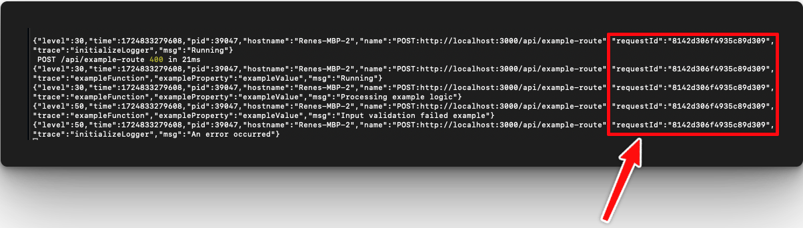
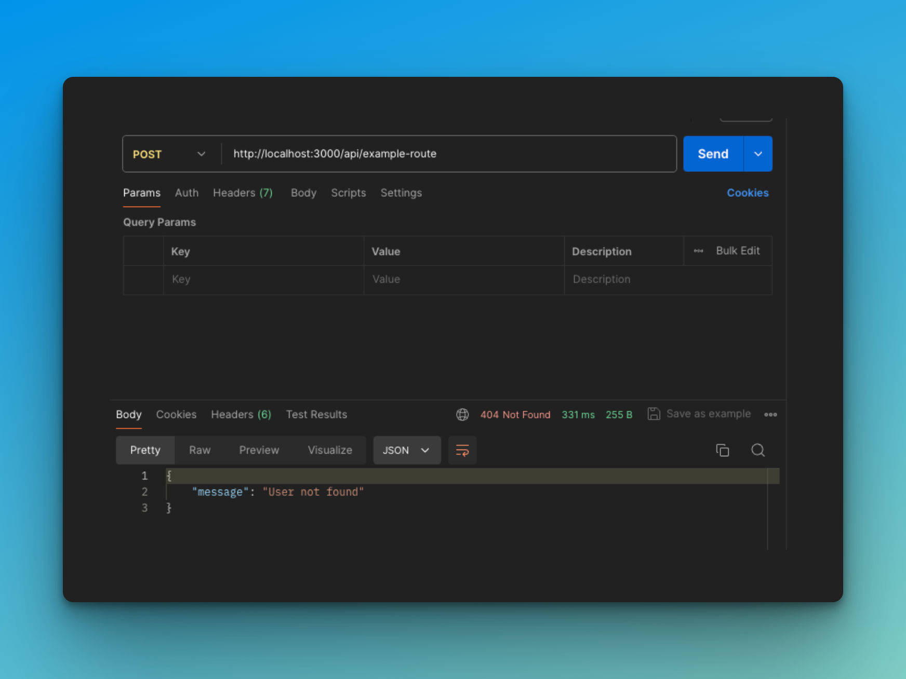
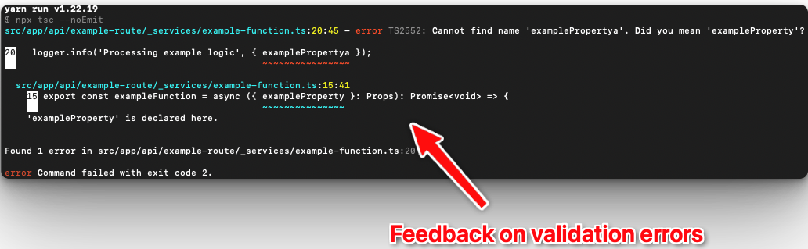

# NextJS API typescript

<p>
    <a href="https://github.com/renenielsendk/nextjs-api-typescript/stargazers"></a>
    <a href="https://github.com/renenielsendk/nextjs-api-typescript/issues"></a>
    <a href="https://github.com/renenielsendk/nextjs-api-typescript/blob/main/LICENSE.md"></a>
</p>

A plug-and-play Next.js application template designed for seamless API handling. Just drop in your business logic and start building robust APIs in minutes.

- [Introduction](#introduction)
- [Built with](#built-with)
- [Features](#features)
  - [Streamlined Logging](#streamlined-logging)
  - [Uniform Error Handling](#uniform-error-handling)
  - [Code Prettier](#code-prettier)
  - [Code Validation](#code-validation)
- [Example Implementations](#example-implementations)
- [Getting Started](#getting-started)
  - [Local Development](#step-1-local-development)
  - [Deploy Your Application](#step-2-deploy-your-application)
- [License](#license)
- [Links](#links)

## Built with

- [Next.js](https://nextjs.org/)
- [TypeScript](https://www.typescriptlang.org/)
- [Node.js](https://nodejs.org/)

## Features

### Streamlined Logging

This project utilizes [Pino logger](https://github.com/pinojs/pino) for streamlined logging, enabling you to easily trace logs throughout the application.

Each inbound request is assigned a unique request ID for precise tracking.



### Uniform Error Handling

You can throw errors anywhere in your implementation using the [APIError](https://github.com/renenielsendk/nextjs-api-typescript/blob/f46d21da47146e0545a1f0e9ba5a6c2e286507d8/src/_shared/types/api.ts#L6).

These errors are consistently caught and returned as HTTP responses.

Example:

```
const user = await db.user.find({ id: '1' });

if (!user) {
  throw new ApiError({
    type: 'NotFoundError',
    message: 'User not found', // optional
  });
}
```

The above example will return Http Status `404` with body `{ message: 'User not found'}`.



### Code Prettier

Running `yarn prettier` will format your code to a consistent style, ensuring a uniform codebase.

### Code Validation

Running `yarn validate` will validate the entire codebase, helping to maintain code quality and consistency.



## Example Implementations

This project includes an example implementation for handling a specific API route, demonstrating how to manage HTTP requests within your application:

### API Route

- **Method**: POST
- **Path**: `/api/example-route`
- **Description**: Handles incoming POST requests with custom logic.

## Getting Started

### Step 1: Local Development

To start working with this project locally, follow these steps:

1. **Fork this repository**: Create your own fork of this repository on GitHub.
2. **Clone the repository**: Clone your forked repository to your local machine.
3. **Navigate to the project directory**: Move into the directory where the project was cloned.
4. **Install dependencies**: Run `yarn install` to install all required dependencies.
5. **Start the development server**: Run `yarn dev` to start the development server.

### Step 2: Deploy Your Application

Once your business logic is implemented, deploy your application using your preferred hosting service (e.g., Vercel, Netlify, Heroku).

### Step 3: Celebrate


## License

Licensed under [MIT](./LICENSE.md).

## Links

Looking for more exciting projects and insights?

👇👇

Connect with me on [𝕏 @renenielsendk](https://x.com/renenielsendk) for updates, tips, and more awesome content!

#nextjs, #nextjs-api, #api, #template
